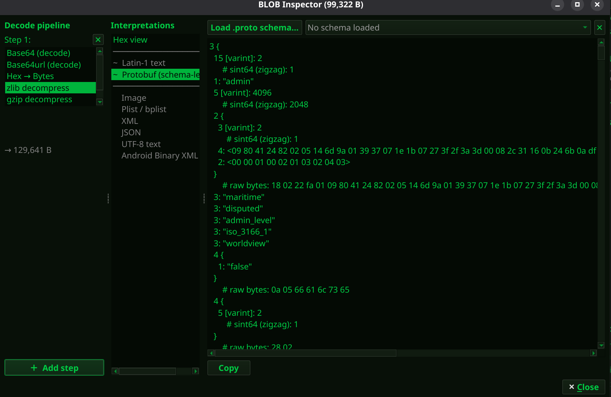
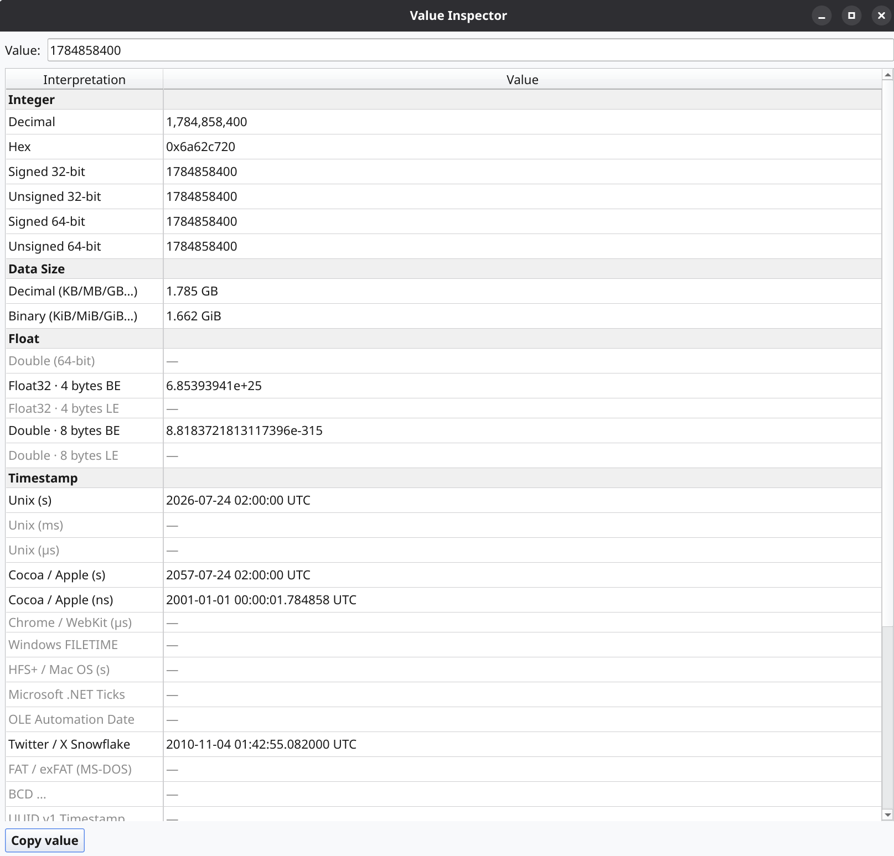

# crush-forensics


Crush — Digital Forensic Analysis Workbench

[](https://github.com/kalink0/crush-forensics/actions/workflows/ci.yml)
[](https://github.com/kalink0/crush-forensics/actions/workflows/nightly.yml)


[](https://github.com/kalink0/crush-forensics/releases)
[](https://github.com/kalink0/crush-forensics/blob/main/LICENSE)


## Features

Open and navigate ZIP, TAR, 7z, Android `adb backup` (`.ab`), and iTunes/Finder iOS backup archives, folders, and individual files without extracting anything to disk first. Mobile backups are reconstructed as the original device filesystem — iOS backups rebuild the `domain/relativePath` tree from `Manifest.db` instead of the flat, hash-named layout on disk; Android backups unpack as a regular filesystem tree.

**Raw disk images & EWF acquisitions** — open raw images via **Open Disk Image…** whatever they're called (`.img`, `.dd`, `.bin`, no extension — what they hold is recognised by partition table or filesystem, not by name), split `.001` sets and EWF (`.E01` + segments) acquisitions directly, no mounting, no admin rights. A disk image is only read as one when opened this way, never probed for on a normal open. Covers NTFS, FAT32, exFAT, ext2/3/4, F2FS, HFS+, APFS, QNX6, QNX4, ETFS, EFS, QNX IFS, and the flash filesystems SquashFS, JFFS2, UBI/UBIFS and YAFFS1/YAFFS2 (also as bare flash dumps). Unallocated space and partitions with an unsupported filesystem are still shown and fully readable, never hidden; deleted files still present in the MFT/FAT (NTFS/FAT32/exFAT) or on the flash (YAFFS2/JFFS2/UBIFS) are recovered into a `$Recovered` folder. An EWF acquisition's own stored hash can be verified against its data on demand. Not a full disk-forensics suite: no unstructured file carving, no journal analysis ($LogFile/$UsnJrnl, ext3/4, HFS+), no VSC/APFS snapshots, and no RAID/LVM assembly; deleted files on unsupported filesystems aren't recovered either.

**Cellebrite UFDR (10.x)** — browse the original device's file/folder tree from a Physical Analyzer report container, reconstructed from the container's embedded PostgreSQL dump rather than its own internal, type-bucketed storage layout, with Cellebrite's own recorded MD5/SHA-256 shown per file. Filesystem browsing only — Cellebrite's other forensic tables (contacts, calls, chats, etc.) are not decoded. Encrypted UFDR containers and split/segmented exports aren't supported yet.

**Password-protected archives** — ZIP (both legacy ZipCrypto and WinZip AES), 7z, encrypted Android backups, and password-protected iTunes backups all prompt for a password when opened, with a retry on a wrong one.

**Built-in file format database** — Crush identifies forensically relevant formats by magic bytes and extension, and shows format name, platform, forensic relevance, and a link to the specification for every selected file, including formats without a dedicated viewer.

**Value Inspector** — shows every plausible interpretation of a pasted or selected value at once: integers, floats, a dozen timestamp epochs, UUIDs, network addresses, and byte sizes (decimal and binary). On Linux, it updates automatically from any text you highlight.

**BLOB Inspector** — chain byte-level transforms (Base64/hex decode, zlib/gzip/lzfse decompress) and render the result as hex, text, JSON, XML, plist, ABX, or Protobuf (schema-less or schema-based) — available on any BLOB cell or pasted value throughout Crush.

**Integrity mode** — optional hashing for auditability: file/ZIP/TAR sources are hashed on open and exports generate a hash manifest (`crush-export-hashes.txt`). Toggle via the bottom-right status badge.

**Send to Peach** — hand a log source (Apple Unified Log, or any other file — same "no pre-filtering, confirm in the tool itself" approach as Multi-Log Studio) off to the bundled sibling log viewer [peach-forensics](https://github.com/kalink0/peach-forensics) for tagging and Splunk-style search, via right-click.

**Run Analyzer** — right-click a directory to run a small, curated analyzer module (ported from [iLEAPP](https://github.com/abrignoni/iLEAPP)/[aLEAPP](https://github.com/abrignoni/aLEAPP) artifact scripts) against it and see the result as a typed, sortable, searchable table — currently three "Installed Applications" modules (iOS, and two independent Android sources).

**C2PA / AI-provenance detection** — Image Viewer reads embedded C2PA (Content Credentials) manifests across JPEG, PNG, GIF, WebP, TIFF, HEIC/HEIF/AVIF, and JPEG XL, showing the generator, edit actions, IPTC Digital Source Type, ingredients, and the claimed signer's identity — structure only, not a cryptographic trust verification. A second, independent check reads the same Digital Source Type straight from XMP for images with no C2PA manifest at all.

Supported viewers (more planned):

- SQLite / Database Viewer
- Hex Viewer
- Text Viewer (with syntax highlighting and encoding detection)
- JSON Viewer (collapsible tree)
- XML Viewer (collapsible tree)
- Plist / BPlist Viewer
- SEGB v1/v2 Viewer
- ABX (Android Binary XML) Viewer
- LevelDB Viewer (Chrome LevelDB / Android app databases)
- MMKV Viewer (Tencent's mmap-backed key-value store, Android/iOS; explicit-only via "Open as")
- Image Viewer
- Media Viewer (audio/video)
- Multi-Log Studio (multi-source log analysis, format auto-detection)
- Protobuf Viewer (schema-less; optional schema decoding)
- PDF Viewer (page rendering, text extraction, revision history)
- Realm Database Viewer (schema and table decoding)

## Forensic Integrity Testing

Beyond "does it parse?", a dedicated test suite checks whether Crush is safe to run on real evidence, on Linux, macOS and Windows:

- **Source immutability** — reading a source leaves it byte-identical.
- **No side effects** — parsing creates no files next to the evidence (e.g. no SQLite `-wal`/`-shm`).
- **Read-only media** — everything works on write-protected evidence.
- **Known-output verification** — committed reference files must parse to exact, pre-computed values.
- **Completeness** — no valid interpretation of a value is ever silently dropped.
- **Reproducibility** — parsing the same input twice gives identical results.

The reference files themselves are SHA-256-pinned; the suite refuses to run if any of them was modified.

Every release runs the suite fresh on its own commit and attaches the result: → [Forensic audit report of the latest release](https://github.com/kalink0/crush-forensics/releases/latest/download/crush-forensic-audit.html) (HTML, downloads; raw data as [JSON](https://github.com/kalink0/crush-forensics/releases/latest/download/crush-forensic-audit.json)). It lists every check with its result per OS and a link to the exact test code, and is attached even when a check fails.

## Documentation

→ [Feature Reference](crush/docs/feature-reference.md)
→ [Format Support & Parser Limitations](crush/docs/format-support.md)
→ [Translating Crush](TRANSLATING.md)

## Blog & Deep Dives

Technical write-ups on the crush viewers — forensic background, workflow, and what to look for:

| Viewer | Post |
|--------|------|
| SQLite | [What Hides in the WAL — SQLite Forensics with crush](https://bebinary4n6.blogspot.com/2026/05/what-hides-in-wal-sqlite-forensics-with.html) |
| RealmDB | [Object by Object — RealmDB Forensics with crush](https://bebinary4n6.blogspot.com/2026/05/object-by-object-realmdb-forensics-with.html) |
| LevelDB | [Reading the CURRENT — LevelDB Forensics with crush](https://bebinary4n6.blogspot.com/2026/05/reading-current-leveldb-forensics-with.html) |
| SEGB / Biome | [Beyond the C — SEGB and Biome Forensics with crush](https://bebinary4n6.blogspot.com/2026/05/beyond-c-segb-and-biome-forensics-with.html) |
| Protobuf | [Reading Protobuf Wire Format Without a Map](https://bebinary4n6.blogspot.com/2026/06/reading-wire-protobuf-without-map.html) |

## Screenshots

Android ABX (Linux)


Android Video (Linux)


Loading Speed - How fast we can load from zips


iOS SEGB (Windows)


iOS SQLite Summary (Windows)


Format Reference (Linux)


Integrity Mode (Linux)


BLOB Inspector (Linux)


Value Inspector (Linux)


## Install and Run

### Package managers

**macOS (Homebrew)**
```bash
brew tap kalink0/forensics
brew trust kalink0/forensics
brew install --cask crush-forensics
```

**Windows (winget)**
```powershell
winget install kalink0.Crush
```

**Windows (Scoop)**
```powershell
scoop bucket add forensics https://github.com/kalink0/scoop-forensics
scoop install forensics/crush-forensics
```

No native package for Linux yet — grab the AppImage from [Releases](https://github.com/kalink0/crush-forensics/releases).

### From source (recommended for development)

1. Create a virtual environment
```bash
python -m venv .venv
source .venv/bin/activate
```

2. Install dependencies
```bash
python -m pip install --upgrade pip
python -m pip install -e .
```

3. Download the Unified Log parser binaries (required for Apple `.tracev3` / `.logarchive` support)
```bash
python scripts/download_unifiedlog_binaries.py
```

4. Download the peach-forensics binaries (required for the "Send to Peach" log-viewer handoff)
```bash
python scripts/download_peach_binaries.py
```

5. Run Crush
```bash
crush
```

### Alternative run command

```bash
python -m crush
```

If you see missing Qt or media errors, install the system dependencies below.

### CLI arguments

```bash
crush /path/to/evidence.zip /path/to/case_folder
crush --open /path/to/evidence.zip --open /path/to/case_folder
```

Positional paths and `--open PATH` (repeatable) are equivalent — each opens
that file or folder on startup, added to the same window's tree. Every
invocation opens a new window.

## System Dependencies

Some Python packages require OS-level libraries on fresh machines.

### Base GUI/Qt runtime (PySide6)

These are required for the Qt GUI to run correctly on Linux.

- Debian/Ubuntu: `sudo apt-get install libgl1 libegl1 libxcb-xinerama0 libxkbcommon-x11-0`
- Fedora: `sudo dnf install mesa-libGL mesa-libEGL libxcb libxkbcommon-x11`
- Arch: `sudo pacman -S mesa libglvnd libxcb libxkbcommon-x11`
- Windows: no additional packages required; if the app fails to start, install the Microsoft Visual C++ Redistributable 2015-2022 (x64)
- macOS: no additional packages required (bundled with the OS)

### libmagic (for `python-magic`)

`python-magic` depends on `libmagic` being present on the system.

- Debian/Ubuntu: `sudo apt-get install libmagic1`
- Fedora: `sudo dnf install file-libs`
- Arch: `sudo pacman -S file`
- macOS (Homebrew): `brew install libmagic`
- Windows: no additional packages required

### Qt Multimedia (for audio/video)

`PySide6` uses system multimedia backends.

- Debian/Ubuntu: `sudo apt-get install gstreamer1.0-plugins-base gstreamer1.0-plugins-good`
- Fedora: `sudo dnf install gstreamer1-plugins-base gstreamer1-plugins-good`
- Arch: `sudo pacman -S gstreamer gst-plugins-base gst-plugins-good`
- macOS: typically bundled with Qt; if media playback fails, install `gstreamer`
- Windows: typically bundled with Qt; no additional packages required

### Audio backend (PulseAudio)

For Linux audio playback, `libpulse` is commonly required by Qt Multimedia.

- Debian/Ubuntu: `sudo apt-get install libpulse0`
- Fedora: `sudo dnf install pulseaudio-libs`
- Arch: `sudo pacman -S libpulse`

## Acknowledgements

This project builds on the great work of the DFIR community. The following third-party modules by [CCL Solutions Group](https://github.com/cclgroupltd) are bundled:

- [ccl_bplist](https://github.com/cclgroupltd/ccl-bplist) — Binary plist module (BSD 3-Clause)
- [ccl_segb](https://github.com/cclgroupltd/ccl_segb) — SEGB (Significant Energy Bearer) module (MIT)
- [ccl_leveldb](https://github.com/cclgroupltd/ccl-leveldb) — LevelDB / Chrome LevelDB module (MIT)

Apple Unified Log (`.tracev3` / `.logarchive`) parsing uses the [macos-UnifiedLogs](https://github.com/mandiant/macos-UnifiedLogs) `unifiedlog_iterator` binary by [Mandiant](https://github.com/mandiant) (Apache License 2.0). The binary is bundled automatically in portable builds. When running from source, run `scripts/download_unifiedlog_binaries.py` to download the platform binaries into `crush/bin/unifiedlog_iterator/` (they are git-ignored and never committed).

MMKV parsing is built on [mmkv-parser](https://github.com/abrignoni/mmkv-parser) by [Alexis Brignoni](https://github.com/abrignoni) (MIT License), vendored unmodified under `crush/third_party/mmkv_parser/`.

**Send to Peach** hands log sources off to [peach-forensics](https://github.com/kalink0/peach-forensics), a sibling forensic log viewer (Apache License 2.0) — tagging, Splunk-style search, no IPC after launch. Sessions aren't persisted for sources Crush had to extract or decrypt first (`--ephemeral-session`), so a handoff never leaves a durable, unencrypted copy of evidence behind. The binary is bundled the same way as `unifiedlog_iterator`; run `scripts/download_peach_binaries.py` when running from source to populate `crush/bin/peach/`.

**Run Analyzer** is built on [crush-analyze](https://github.com/kalink0/crush-analyze), a sibling project (Apache License 2.0) that runs small, curated analyzer modules ported from [iLEAPP](https://github.com/abrignoni/iLEAPP)/[aLEAPP](https://github.com/abrignoni/aLEAPP) artifact scripts by [Alexis Brignoni](https://github.com/abrignoni) (MIT License) against a directory, over a versioned JSON contract — a normal pip dependency of Crush, not a separately bundled binary.

Special thanks to [@dugeonlady](https://github.com/dugeonlady) for suggesting the Rainbow theme — because digital forensics tools don't have to be grey. Or dark. Someone has to bring colour to the hex dump. Evidence: *View → Theme → Rainbow*. She was right.


Parts of this software were developed with assistance from [Claude AI / Claude Code](https://claude.ai) by Anthropic.

## Bugs and feature requests

Use [GitHub Issues](https://github.com/kalink0/crush-forensics/issues). Please include the Crush version (shown in **Help → About**), your OS, and steps to reproduce.